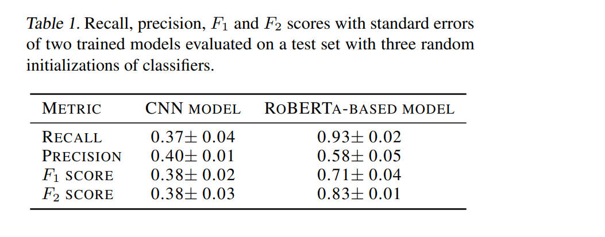

The use of pre-trained embeddings or pre-trained architectures provides a solid basis for achieving
high results on the identification of hatefull tweets. The RoBERTa-based model achieves better results than the CNN
model. The increase in performance is due to the pre-trained embeddings provided by a model trained on tweets. Table 1 shows the achieved results.

See report.pdf for more information

### Installation:
- install pytorch: https://pytorch.org/get-started/locally/
- Install the following packages: ` torchtext torchmetrics mlxtend matplotlib install nltk emoji transformers regex requests hydra-core omegaconf statsmodels seaborn scipy`
- install spaCy: https://spacy.io/usage

### Run:
- download dataset at https://bit.ly/3HUgNPo and extract into the folder `raw_data`
- run `run.py` from the main project folder

